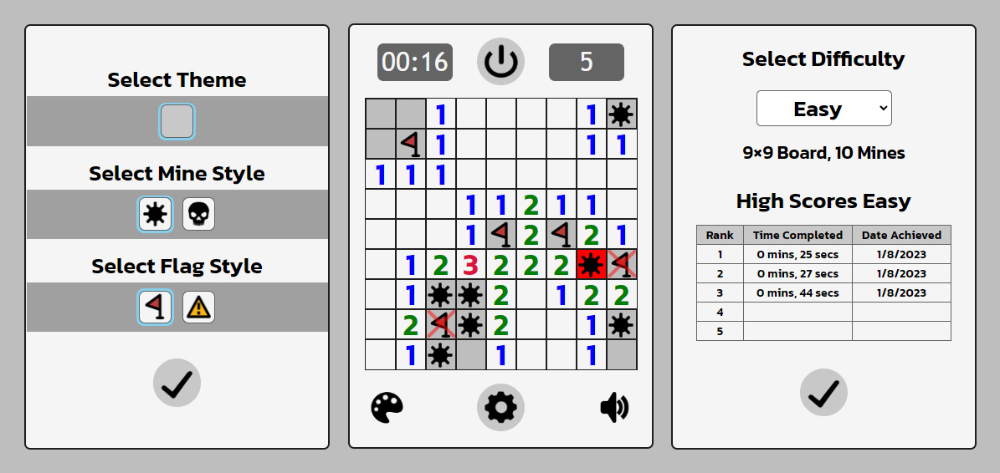

# Minesweeper
 
 Minesweeper is a puzzle game where you open tiles on a board and use the numbers as hints as to where the mines are. The main Objective is to clear the Board without detonating any of these mines. Good Luck!

&nbsp;
 
&nbsp;
## Languages & Tools
 ---
 The following technology was used in order to create Minesweeper:
 - JavaScript
 - HTML
 - CSS
 
## Website
 ---
 This game is available at: [https://speckoh.github.io/minesweeper/](https://speckoh.github.io/minesweeper/)

## How to Play
 ---
 1. &nbsp; Left-Click to reveal any tiles on the board.
 2. &nbsp; The numbers represent how many mines are around that tile.
 3. &nbsp; Use this as a clue to figure out where the mines are located.
 4. &nbsp; Right-Click to place flags on possible mine locations.
 5. &nbsp; Once you open up all the tiles that doesn't have a mine, you win!

## Future Updates 
 ---
### Version 4
 - As a user, I want to have a selection of different Color Themes to choose from.
 - As a user, I want to be able to customize the Size of the Board as well as the amount of Mines.

### Version 5
 - As a user, I want a feature that allows the player to mark a square with a Question Mark.
 - As a user, I want a Simple How to Play Read me Tutorial.
---
