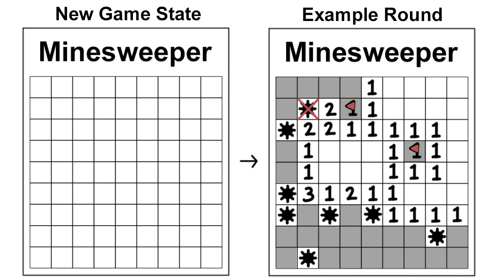
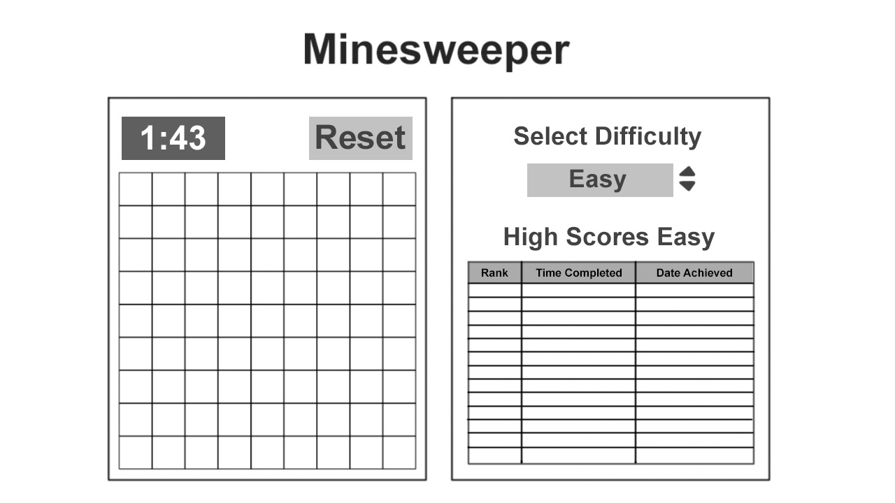

# Minesweeper

## MVP

### Version 1.0
 - As a user, I want a 9 X 9 Board of Squares.
 - As a user, I want each Square on the Board to Hide what's Underneath.
 - As a user, I want the player to be able to click on a Square and for it to uncover what's underneath it, which can either be a Number, Mine, or Empty Square.
 - As a user, when I Click on an Empty Square, for a flood effect to take place.
 - As a user, when I Click on a Square and if it's not Empty to Display a Number or Mine.
 - As a user, I want to be able to mark a square with a Flag via the Right Mouse Click.
 - As a user, I want to have a Losing Message when the player clicks on a Mine.
 - As a user, I want to have a Winning Message when the player opens up all the Squares that does not have a Mine.
 - As a user, After Game Completion, I want all Mines to be Revealed

 
 ---
## UPDATES

### Version 2.0
 - As a user, I want the player to be able to select between three Difficulty Settings.
 - As a user, I want a Timer and for it to output a Score if the player wins the Round.
 - As a user, I want a Scoreboard for each Difficulty.
 - As a user, I want the Scoreboard to Switch depending on the Difficuly Settings.
 - As a user, I want my score to display on the ScoreBoard if it's better than the other scores.
 - As a user, I want each Different Number to be a Different Color.
 - As a user, I want a Button to Reset the Board.
 - As a user, I want the Square to turn Red if player clicks on a Mine.



### Version 3.0
 - As a user, I want the player to know the amount of mines the board has.
 - As a user, I want a feature that allows different Color Themes.
 - As a user, I want a feature to change the Look of the Mine.
 - As a user, I want a feature to change the Look of the Flag.
 - As a user, I want to be able to customize the Size of the Board as well as the amount of Mines.
 - As a user, I want a feature that allows the player to mark a square with a Question Mark.
 - As a user, I want sound effects.
 - As a user, I want a Simple How to Play Read me Tutorial.
---
## PSEUDOCODE for MVP Version 1.0

### As a user, I want a 9 X 9 Board of Squares
 ```
    Specify the Height and Width of the Board to be 9
    Then Specify the Area of the Board by Height * Width
    Then Specify the Amount of Mines in this Board to be 10

    Create a Board with that Height & Width
    Create this Board Array
    Randomly place the Specified Amount of Mines
    Across the Board
    Add these Mines to the Mine's Array
```
### As a user, I want to Make each Square Clickable
```
    Add an Event To check for each Square being clicked
```
### As a user, I want each square to Check for Mines and If I Click on a Mine to Create a Losing Message
```
    If the player clicks on a Square that matches the index of one of the Mines in the Mine's Array
    Reveal the Square to be a Mine via a Sprite Change
    Player Loses the Game.
    Display a Losing Message on Screen and all Mines to be Revealed.
```
### As a user, I want the square to reveal a number if it is not a Mine
```
    Else, If the player clicks on a Square that does not match the index of one of the Mines in the Mines Array,
    Check all adjacent Squares of the clicked Square.
    Count how many of these adjacent Squares contain a Mine
    If the adjacent Squares is greater than or equal to 1,
    then the Square that was clicked will Reveal the amount of Mines around it. 
    Once a Square is revealed, remove this from the Board Array.
```
### As a user, I want a Flood Effect if Square is Empty
```
    Else, If there are no mines around the clicked Square, 
    then Reveal the Empty clicked Square and check all adjacent Squares around this Empty Square
    for a Mine around those Squares in much the same way from a few steps earlier.
    All revealed Squares will also be removed from the Board Array.
```
### As a user, I want to be able to Mark Square with Flags
```
    Add an Right Click Event to allow the player to place a Flag on any unrevealed Square that they suspect to be the location of a Mine.
```
### As a user, I want a Winning Message to Appear if Conditions are Met
```
    Check for when All Squares on the Board that is not a Mine is revealed everytime a Square is revealed.
    If the Board Array is empty or all Squares inside this Array is equal to Mine, then the player has Won!
    Display a Winning Message on Screen and all Mines to be Revealed.
```
